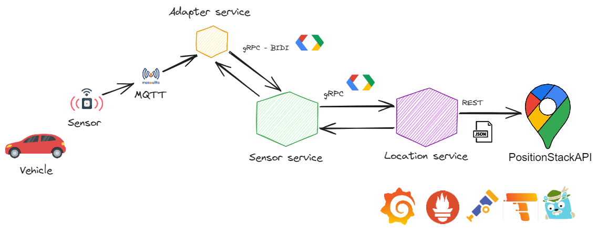
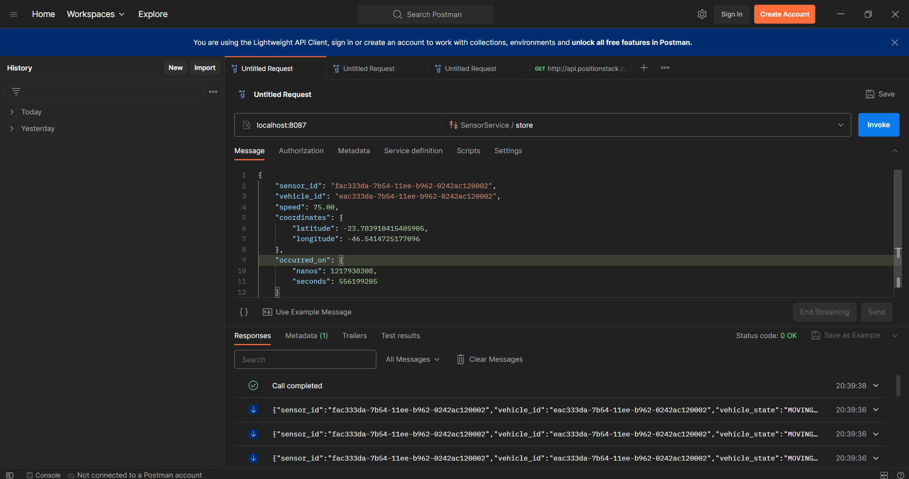
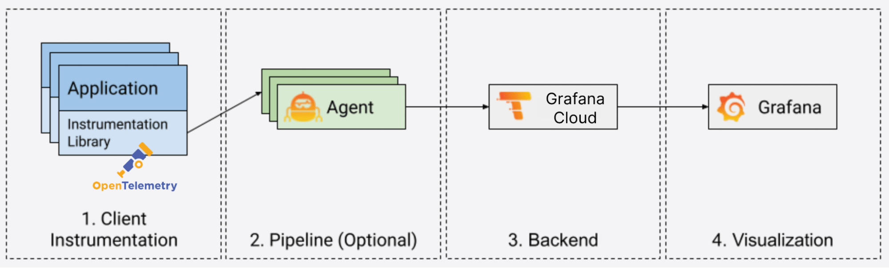
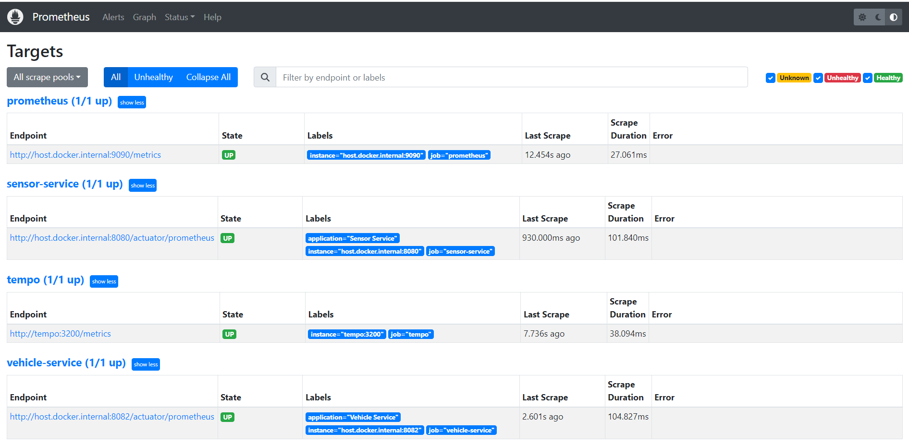
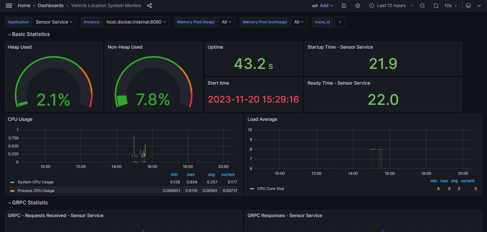
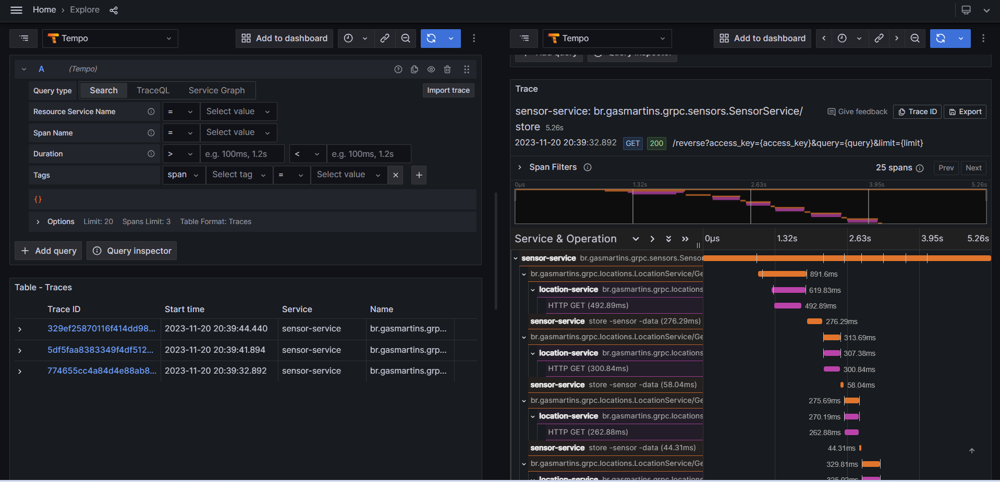
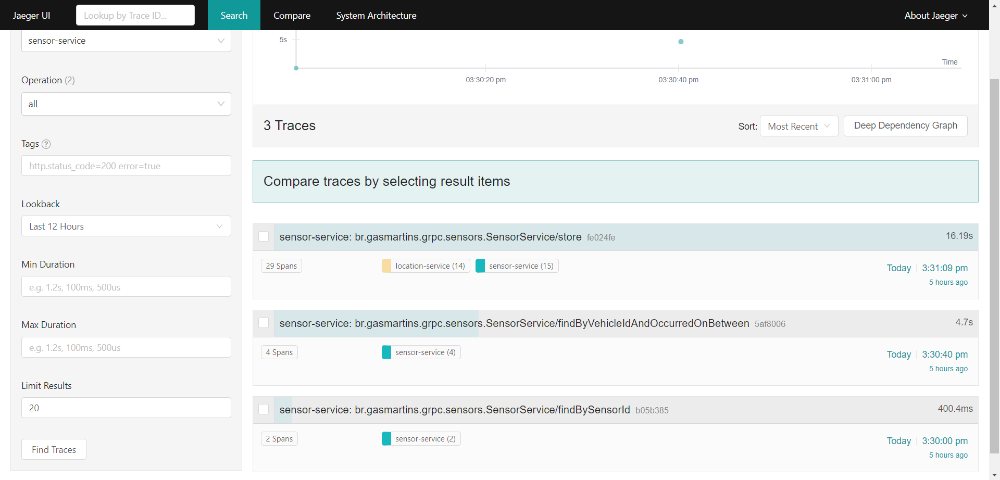
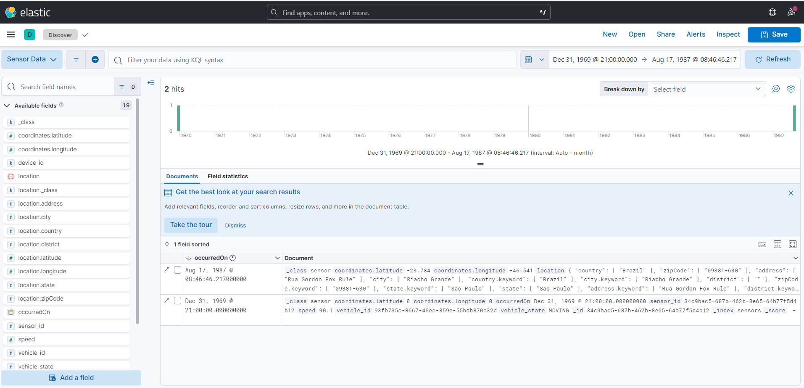

# Vehicle Location Grpc Tracing

This project is an example of using SpringBoot 3 using Grpc and Micrometer Tracing



 Technologies:

- [SpringBoot 3](https://docs.spring.io/spring-boot/docs/current/reference/htmlsingle/)
- [Spring Cloud OpenFeign](https://docs.spring.io/spring-cloud-openfeign/docs/current/reference/html/)
- [SpringBoot Grpc]("https://yidongnan.github.io/grpc-spring-boot-starter/en/")
- [Elasticsearch](https://java.testcontainers.org/modules/elasticsearch/)
- [Testcontainers](https://testcontainers.com/guides/getting-started-with-testcontainers-for-java/)
- [Micrometer](https://micrometer.io/docs/tracing)
- [Prometheus](https://prometheus.io/docs/prometheus/latest/installation/)
- [OpenTelemetry](https://opentelemetry.io/docs/instrumentation/java/)
- [Grafana](https://grafana.com/docs/)
- [Grafana Tempo](https://grafana.com/docs/tempo/latest/)
- [Jaeger](https://www.jaegertracing.io/docs/1.18/opentelemetry/)

> The architecture was based on the explanation of the ideas in the book <a href="https://www.amazon.com/Practical-Domain-Driven-Design-Enterprise-Java/dp/1484245423">**Practical Domain-Driven Design in Enterprise Java Using Jakarta EE, Eclipse MicroProfile, Spring Boot, and the Axon Framework**</a> by **Vijay Nair**

<p align="center">

</p>

# Getting Started

In order to setup the development environment you need to run the follow command:


```bash
$ docker-compose up -d
```

After that just run the two application using the command:

```bash
$ ./gradlew bootRun --args='--spring.profiles.active=local'
```

You can use postman, grpcurl or other tools like BloomRPC and Insomnia to send requests.

In Postman go to the menu **New** > **gRPC** > **Service Definition** > **Import .proto file** > **Add an import path**

Choose the path `<path_to_the_folder>\vehicle-location-grpc-tracing\sensor-service\src\main\proto`

After that click in **Choose a file**, select the proto file and click on **Import** button

Use the endpoint **localhost:8087** and select the desired method



# Opentelemetry Collector

The traces are collected by OpenTelemetry Colllector and used in Jaeger and Grafana Tempo



# Prometheus

You can see the Prometheus dashboard in browser using http://localhost:9090/targets?search=



# Grafana

You can see the Grafana dashboard in browser using http://localhost:3000/d/vehicle_location_system_monitor/vehicle-location-system-monitor



# Grafana Tempo

You can see the traces on Grafana Tempo in browser using http://localhost:3000/explore?panes=%7B%22hzF%22:%7B%22datasource%22:%22tempo%22,%22queries%22:%5B%7B%22refId%22:%22A%22,%22datasource%22:%7B%22type%22:%22tempo%22,%22uid%22:%22tempo%22%7D,%22queryType%22:%22traceqlSearch%22,%22limit%22:20,%22tableType%22:%22traces%22,%22filters%22:%5B%7B%22id%22:%22b2bc85f2%22,%22operator%22:%22%3D%22,%22scope%22:%22span%22%7D%5D%7D%5D,%22range%22:%7B%22from%22:%22now-12h%22,%22to%22:%22now%22%7D%7D,%22Get%22:%7B%22datasource%22:%22tempo%22,%22queries%22:%5B%7B%22query%22:%22774655cc4a84d4e88ab8c48106b56f5f%22,%22queryType%22:%22traceql%22,%22refId%22:%22A%22,%22limit%22:20,%22tableType%22:%22traces%22%7D%5D,%22range%22:%7B%22from%22:%221700480396290%22,%22to%22:%221700523596290%22%7D%7D%7D&schemaVersion=1&orgId=1



# Jaeger

You can see the traces on Jaeger in browser using http://localhost:16686/



# Kibana

You can see the data collected on Kibana Dashboard using [http://localhost:5601/app/discover#/?_g=(filters:!(),refreshInterval:(pause:!t,value:60000),time:(from:'1970-01-01T00:00:00.000Z',to:'1987-08-17T11:46:46.217Z'))&_a=(columns:!(),filters:!(),index:'915e33c6-f863-4ae7-9f49-69dea911df1e',interval:auto,query:(language:kuery,query:''),sort:!(!(occurredOn,desc)))](http://localhost:5601/app/discover#/?_g=(filters:!(),refreshInterval:(pause:!t,value:60000),time:(from:'1970-01-01T00:00:00.000Z',to:'1987-08-17T11:46:46.217Z'))&_a=(columns:!(),filters:!(),index:'915e33c6-f863-4ae7-9f49-69dea911df1e',interval:auto,query:(language:kuery,query:''),sort:!(!(occurredOn,desc))))

